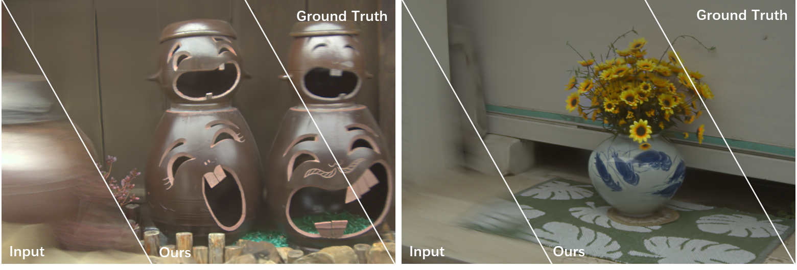

# Deblur-GS: 3D Gaussian Splatting from Camera Motion Blurred Images
Official  implementation of paper "Deblur-GS: 3D Gaussian Splatting from Camera Motion Blurred Images", I3D 2024

>Deblur-GS: 3D Gaussian Splatting from Camera Motion Blurred Images
>
>Wenbo Chen, Ligang Liu
>
>I3D 2024
>
>[project page](https://chaphlagical.icu/Deblur-GS/) [paper](http://doi.acm.org/10.1145/3651301) [dataset](https://drive.google.com/drive/folders/1d8hAA-Wi3UoInQZCv-wc4A2efjuopqsQ?usp=sharing)



## Abstract

Novel view synthesis has undergone a revolution thanks to the radiance field method. The introduction of 3D Gaussian splatting (3DGS) has successfully addressed the issues of prolonged training times and slow rendering speeds associated with the Neural Radiance Field (NeRF), all while preserving the quality of reconstructions. However, 3DGS remains heavily reliant on the quality of input images and their initial camera pose initialization. In cases where input images are blurred, the reconstruction results suffer from blurriness and artifacts. In this paper, we propose the Deblur-GS method for reconstructing 3D Gaussian points to create a sharp radiance field from a camera motion blurred image set. We model the problem of motion blur as a joint optimization challenge involving camera trajectory estimation and time sampling. We cohesively optimize the parameters of the Gaussian points and the camera trajectory during the shutter time. Deblur-GS consistently achieves superior performance and rendering quality when compared to previous methods, as demonstrated in evaluations conducted on both synthetic and real datasets

## Installation

```shell
SET DISTUTILS_USE_SDK=1 # Windows only
conda env create --file environment.yml
conda activate deblur_gs
```

## Running

### Training

```shell
python train.py -s <path to dataset> --eval # Train with train/test split
```

Additional Command Line Arguments for `train.py`

* `blur_sample_num`: number of key frames for trajectory time sampling
* `deblur`: switch the deblur mode
* `mode`: models of camera motion trajectory (i.e. Linear, Spline, Bezier)
* `bezier_order`: order of the Bézier curve when use Bézier curve for trajectory modeling

### Evaluation

```shell
python train.py -s <path to dataset> --eval # Train with train/test split
python render.py -m <path to trained model> # Generate renderings
python metrics.py -m <path to trained model> # Compute error metrics on renderings
```

Additional Command Line Arguments for `render.py`

* `optim_pose`: optimize the camera pose to align with the dataset

### Render Video

```shell
python render_video.py -m <path to trained model>
```

## BibTex

```latex
@article{Chen_deblurgs2024,
   author       = {Wenbo, Chen and Ligang, Liu},
   title        = {Deblur-GS: 3D Gaussian Splatting from Camera Motion Blurred Images},
   journal      = {Proc. ACM Comput. Graph. Interact. Tech. (Proceedings of I3D 2024)},
   year         = {2024},
   volume       = {7},
   number       = {1},
   numpages     = {13},
   location     = {Philadelphia, PA, USA},
   url          = {http://doi.acm.org/10.1145/3651301},
   doi          = {10.1145/3651301},
   publisher    = {ACM Press},
   address      = {New York, NY, USA},
}
```
